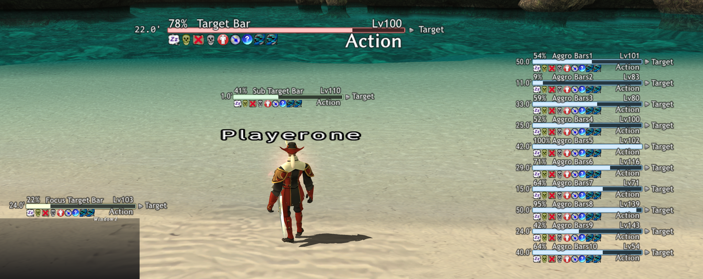

## healthbar

Windower4用HPバー表示アドオンです。  
下記のアドオンを参考にして作成しています。

|addon     |URL                                                            |
|----------|---------------------------------------------------------------|
|enemybar  |https://github.com/Windower/Lua/tree/live/addons/enemybar      |
|enemybar2 |https://github.com/AkadenTK/enemybar2                          |
|TargetBar |https://github.com/ds-public/ffxi_addons/tree/master/TargetBar |

### 機能

1. ターゲット（カーソルで選択している対象）のHPバー/残りHP%を表示
1. ターゲットに掛かっているデバフをアイコンで表示
1. ターゲットのレベルを表示
1. ターゲットとの距離を表示
1. ターゲットが実行中のTP技、SPアビ、詠唱中の魔法を表示
1. ターゲットが最後に敵対行動した相手を表示（ヘイトトップとは異なる場合があります）
1. サブターゲットとして選択中の対象について1～6と同様の情報を表示
1. 任意の対象について1～6同様の情報を常時個別に表示（フォーカスターゲット）
1. 交戦中の敵について1～6同様の情報を表示

### 注意事項

#### モンスターのLv情報について
敵レベル情報は広域スキャンの結果から取得しています。（広域スキャンの結果パケットでしかレベルを知る術がない。/checkだと通常モンスターのレベルは取得できるが、NMのレベルはわからない。）

layoutファイルでレベル情報の表示を有効にした上で（`各種bar > texts > level > show` を `true` にする）、広域スキャンを実行するとスキャン対象になった敵のレベルが表示されるようになります。

`settings.xml`の`auto_widescan`を `true`にすることで自動広域スキャンを行うようにできます。この自動広域スキャンが有効になっていると、前回実行から一定時間が経過している、前回実行した場所から一定距離以上移動している、レベル不明のNPCをターゲットした、などの条件で自動的に広域スキャンを実行し、結果として周辺の敵のレベルを取得し蓄積します。なお、このときマップは開きません（スキャン実行のパケットを直接送信しています）。例えばBF内など本来手動での広域スキャンができない場所でもスキャンを実行して結果を取得できてしまうので、自動広域スキャン機能の取り扱いにはご注意ください。デフォルトではOFFになっています。

#### モンスターのデバフ情報について

NPCのデバフ情報（デバフが掛かった/効果が切れた）は主にパケットとWindower4リソースファイルに含まれる追加効果情報から追跡しています。この認識精度はあまり高くありません。特にダメージを与えつつ状態異常を付与するような魔法は追跡されないことが多いです。パケット内容はプライベートサーバによって異なるため、サーバによっても取得できる/できないが変わってくるものと思われます。

効果時間についてはアテになるような精度で情報を取得する方法がわからないためこのアドオンでは表示できません。

#### ステータスアイコンについて

このアドオンにはステータスアイコン画像ファイルが含まれていません。画像ファイルがない場合にはアイコンが白四角で表示されます。アイコン画像は自力で引っこ抜いて`assets/icons/`にPNG
形式で格納してください。普段[XI-View](https://github.com/Caradog/XI-View)を使用して自分のステータスアイコンを変更しているのであれば、[XivParty](https://github.com/Tylas11/XivParty)に付属しているアイコン`assets/bufficons/*.png`を持ってくるのが良いかと思われます。（ただしXI-Viewのアイコンは回避ダウンと魔回避ダウンの区別がつかないなどの制約あり）

#### 交戦中の敵の判定について

このアドオンでは敵対モンスター情報を表示できますが、この敵対しているかどうかというのは「自分またはPTメンバがNPCに対して行動した」もしくは「NPCが自分またはPTメンバに対して行動した」のをパケットから追跡して判断しています。いわゆるヘイトリストを参照しているわけではなく（そもそも参照手段がない）、敵に絡まれただけでは表示されませんが仕様です。

#### 動作確認環境

プライベートサーバ（Nocturnal SoulsとLandSandBoatのサーバ）でのみ動作確認を行っています。本家サーバで動作するかは不明です。

### 使い方

#### 導入

1. Code > Download ZIP でダウンロードして、展開した中身を`addons/healthbar/`に配置します。（`healthbar-main`フォルダを`healthbar`にリネームして`addons`フォルダに入れる）
1. `//lua l healthbar` でロードします。（またはinit.txtに記載するなどして自動的にロードされるようにする）
1. ステータスアイコンを表示させたい場合は[XivPartyアドオン](https://github.com/Tylas11/XivParty)のをこのアドオンの`assets/icons/`にコピーしてください。（XivPartyにはXiview2.0のアイコンが含まれています。）
1. `//bar setup`を実行するとバー情報一式が表示されるセットアップモードになるので、バーをドラッグアンドドロップで好みの場所に移動させます。`//bar setup`を再度実行するとセットアップモードが終了し、バーの位置が `data/settings.xml`に保存されます。（次回以降の起動ではこの保存された位置に表示されるようになります）

#### コマンド

- `//bar setup`  
通常モード⇔セットアップモードの切り替えを行います。セットアップモードでは表示確認用の情報が表示され、各バーの位置をマウスのドラッグアンドドロップで編集できます。

- `//bar f`  
カーソルで選択しているPC/NPC（&lt;t&gt;相当）をフォーカスターゲットの対象にします。`f`の後に`t` `st` `bt` `lastst` をつけるとそれに該当するPC/NPCが対象になります。

#### 設定ファイル

初回ロード時にアドオンフォルダ内に`data/settings.xml`が作成されます。このファイルにはバーの位置情報の他に以下の設定値が含まれており、これらの設定を変えたい場合はXMLを直接編集してアドオンをリロードしてください。

|設定値         |内容                                                                                                                     |
|---------------|-------------------------------------------------------------------------------------------------------------------------|
|`layout`       |レイアウトファイル（後述）としてどのファイルを使用するかファイル名（拡張子なし）を指定します。                           |
|`auto_widescan`|`true`にすると一定時間経過/一定距離以上移動/Lv未取得のNPCをターゲットした、などの条件で自動的に広域スキャンを実行します。|
|`widescan_log` |`true`にすると広域スキャンが実行されたときにログを出力します。                                                           |

#### レイアウトの変更

バーの長さ、各種テキストの表示有無と位置、フォントを変更するには、レイアウトファイルを直接編集してください。

標準で付属している `layouts/layout.xml` を適当な名前でコピーして編集後、`data/settings.xml`の`layout`要素にファイル名（拡張子不要）を指定することで適用されます。

レイアウトファイルの中身は勘で判断してください。`layouts`フォルダ内には作者の利用しているレイアウトファイル`layout2000x1125.xml`, `layout1280x720.xml`が格納されているので例としてご利用ください。

**（分かりにくそうな箇所について補足）**  
各バーの`texts`要素内で各種テキストの表示位置やフォントを指定していますが、`texts > base`が全項目共通となるベース設定となり、`texts > name`や`texts > level`といった各項目テキストの設定値は`base`の値を上書きして利用されます。各項目は`base`との差分だけを記述すればOKです。

